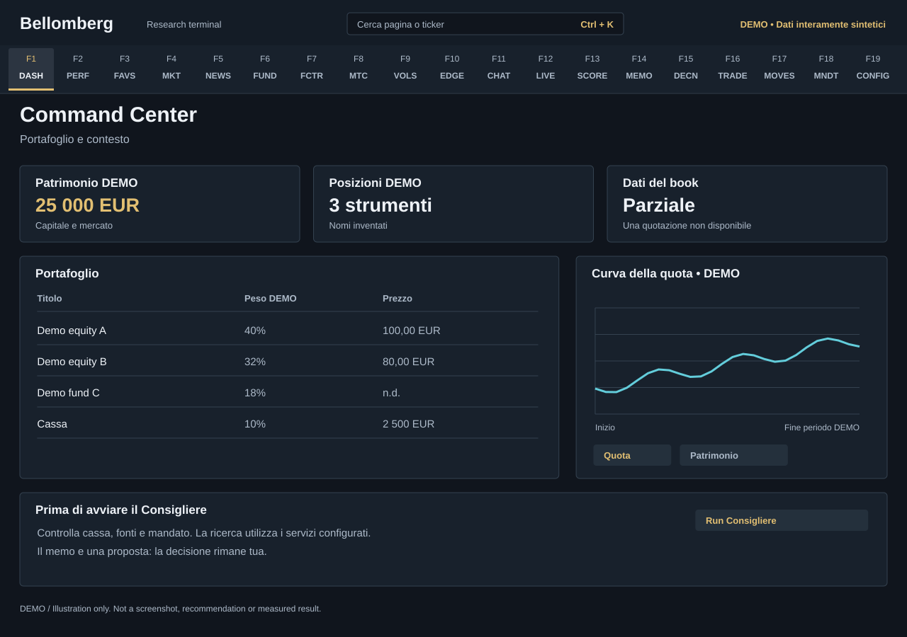

# Bellomberg

**A personal investment research terminal: your portfolio, your mandate, a team of specialist agents.**

Bellomberg brings portfolio accounting, market research, valuation, risk analysis
and an AI research committee into one local desktop application. Keep track of
what you own, test an idea, inspect the evidence behind a recommendation and
record what you decided. You remain the decision maker.



*Illustration, not a screenshot: a simplified layout with mostly Italian labels.
All instruments, values and research text in the documentation mockups are
invented. Your installation starts with an empty book.*

[Install](#install-on-windows) · [First session](docs/guide/first-session.md) ·
[Full handbook](docs/guide/README.md) · [Updates and privacy](docs/guide/updates.md)

## What you can do

- **Understand your portfolio.** Positions, trades and cash share one SQLite
  ledger. Inspect performance, attribution, concentration, factors and scenarios.
- **Research a security.** Search markets, follow news and filings, review
  generated valuations, and ask a specialist a question from its own domain.
- **Study options.** Choose a final expiration or the entire provider catalogue;
  download chains progressively with pause/resume, inspect quotes and Greeks,
  read the volatility surface, and simulate multi-leg strategies.
- **Run a committee.** Macro, Events, Crypto, Fundamentals, Quant and Options
  desks research the current book. Red-team review challenges the work; the Capo
  synthesizes a memo and proposed decisions.
- **Keep an accountable research record.** Read prior memos, record feedback,
  inspect saved score history and maintain a versioned investment journal.

Choose **English or Italian** after the first login and change it in Settings.
Saved memos and source quotations retain their original language; switching the
interface does not regenerate research. Bellomberg is research software, not a broker or an
automated trading service. Valuations, simulations and AI responses are estimates
or analysis. This is not financial advice and outcomes are not guaranteed.

## Install on Windows

The validated desktop workflow is Windows with an external Python backend.
You need **Git**, **Python 3.10+** and **Node.js 22.12+**. Python 3.12 and Node 22
are the documented CI baseline; Linux CI also checks Python 3.14. A fresh Windows
source installation has been exercised with Python 3.14 and Node 24. Keep the
checkout and live database on a local disk, outside folders synchronized while
the application is writing.

1. On the public repository page, choose **Code → HTTPS → Copy**. Replace
   `<repository-url>` below with that address. The repository name is deliberately
   not assumed.

   ```powershell
   git clone <repository-url> bellomberg
   cd bellomberg
   ```

2. Install the Python package in its own environment. These commands call the
   environment directly, so PowerShell activation-policy changes are unnecessary.

   ```powershell
   python -m venv .venv
   .\.venv\Scripts\python.exe -m pip install -e . pytest
   Copy-Item .env.example .env
   ```

   In an activated environment, the equivalent package command is
   `python -m pip install -e . pytest`. The installed `bellomberg-api` entry
   point starts the backend independently when you want its logs in a separate
   terminal; see the installation guide for the explicit Windows path.

3. Open `.env` in a text editor. Set `BELLOMBERG_PIN` to **four ASCII digits**,
   different from the rejected default `1234`. For AI features, add your own
   `OPENROUTER_API_KEY` and review the per-function model settings. Add market-data
   keys only for the features you want; US filings and European reports also need
   `SEC_CONTACT_EMAIL`. Keep the delivery fields `EMAIL_FROM`, `EMAIL_PASSWORD` and
   `EMAIL_TO` empty unless you intend to configure delivery. See
   [configuration](docs/guide/configuration.md).

4. Install the desktop dependencies and Electron executable.

   ```powershell
   cd app
   npm ci
   npm run desktop:install
   cd ..
   ```

5. Point Electron to this backend and its Python environment, then launch.

   ```powershell
   $env:BELLOMBERG_BACKEND_DIR = (Get-Location).Path
   $env:BELLOMBERG_PYTHON = (Resolve-Path .venv\Scripts\python.exe).Path
   cd app
   npm run dev
   ```

   Keep this terminal open. Electron starts the backend if it is not already
   running. Sign in with your PIN, choose English or Italian and save the choice.
   A new profile then opens **F18 Mandate and Journal**; the other pages remain
   reachable. When using a new terminal, set the environment variables again
   before launching.

The [installation guide](docs/guide/installation.md) includes expected results,
separate backend startup, installed-desktop configuration and troubleshooting.
The Windows installer contains the interface; it **does not contain Python,
backend dependencies or your data**. It is unsigned unless a release explicitly
states otherwise. Neither the macOS source CI job nor the platform-contract tests
(which run without Electron or Python) establish a successful installation on a
physical Mac. No macOS bundle, signature, notarization or Linux installer is
certified; see the
[exact platform limits](docs/guide/installation.md#macos-and-linux).

## Your first research session

1. Open **F16 Trade Entry**. Record your initial deposit to initialize cash, then
   enter actual trades with their execution date. Use **Opening position** to declare an existing
   holding's quantity, unit cost, currency, balance date and source. An opening
   balance creates no cash movement or invented purchase. Review each preview
   before confirming. Neither workflow sends an order to a broker.
2. Check **F1 Command Center** and **F17 Movements** against your own records.
   Missing prices or FX must be investigated before trusting dependent totals.
3. Open **F18 Mandate**, define your own preferences, validate the preview and
   save. The committee will not run with a missing or invalid mandate.
4. Try **F11 Agent Chat**. Select a desk and use a suggested question or one of
   your portfolio ticker buttons. Clicking a ticker sends a question tailored to
   the selected desk and can incur model charges.
5. When ready, start a committee run from **F1**, **F12** or **Ctrl+K**, review
   the confirmation and follow **F12 Agents Live**. Read the result in
   **F14 Memo Archive** and record your response in **F15 Decisions**.
6. Use **F13 Agent Progress** to inspect saved outcomes and limitations. Keep
   your own evolving thesis in **F18 → Journal** (*Diario*); journal notes are
   not sent to agents automatically.

Follow the [complete walkthrough](docs/guide/first-session.md) for dependencies,
empty states and what to inspect before progressing.

## The terminal, page by page

Use the menu or **Ctrl+K** and type a page name or its function label. All nineteen
destinations are available; settings are last. F13–F19 remain accessible even on
a keyboard that has no physical keys with those names.

| Key | Destination | What it is for |
| --- | --- | --- |
| F1 | [Command Center](docs/guide/pages/01-command-center.md) | Portfolio overview, price refresh and committee launch |
| F2 | [Performance](docs/guide/pages/02-performance.md) | TWR, benchmark, drawdown and attribution |
| F3 | [Watchlist](docs/guide/pages/03-watchlist.md) | Companies to research and personal watch notes |
| F4 | [Global Markets](docs/guide/pages/04-global-markets.md) | Security search, charts, financials and holders |
| F5 | [News Desk](docs/guide/pages/05-news-desk.md) | News, briefings and event calendars |
| F6 | [Fundamentals](docs/guide/pages/06-fundamentals.md) | Generated valuations and their assumptions |
| F7 | [Factor Lab](docs/guide/pages/07-factor-lab.md) | Economic exposures and model diagnostics |
| F8 | [Monte Carlo](docs/guide/pages/08-monte-carlo.md) | Portfolio scenarios and distributions |
| F9 | [Vol Deck](docs/guide/pages/09-vol-deck.md) | Expirations, surface, Greeks and strategy laboratory |
| F10 | [Edge Scanner](docs/guide/pages/10-edge-scanner.md) | Ranked research signals and their supporting data |
| F11 | [Agent Chat](docs/guide/pages/11-agent-chat.md) | Specialist conversations and portfolio ticker questions |
| F12 | [Agents Live](docs/guide/pages/12-agents-live.md) | Run status, tool activity, timing and recorded costs |
| F13 | [Agent Progress](docs/guide/pages/13-agent-progress.md) | Score history, uncertainty and lessons |
| F14 | [Memo Archive](docs/guide/pages/14-memo-archive.md) | Research history, PDFs and linked decisions |
| F15 | [Decisions](docs/guide/pages/15-decisions.md) | Proposal status, feedback, vetoes and research notes |
| F16 | [Trade Entry](docs/guide/pages/16-trade-entry.md) | Record trades and cash movements |
| F17 | [Movements](docs/guide/pages/17-movements.md) | Inspect the trade and cash ledger |
| F18 | [Mandate and Journal](docs/guide/pages/18-mandate-journal.md) | Your declared rules and private, versioned notes |
| F19 | [Settings](docs/guide/pages/19-settings.md) | Backups, scheduled tasks and system status panel |

Each linked chapter includes an original synthetic mockup, the controls to use,
the data it needs, and how to interpret missing or uncertain results. Mockups
use mostly Italian labels and simplified layouts that can differ from the app.

## Your data and your choices

Positions, trades and cash live in **SQLite**, normally
`data/consigliere.db`. Journal entries and saved agent progress use the same
database. Configuration, mandate and instrument-specific metadata are private
runtime files. New installations do not use or require `portfolio.json`.
An Excel portfolio is not an input to the ledger.
[Runtime locations and configuration](docs/guide/configuration.md)
explain how to keep these files outside a source checkout if desired.

Public source is prepared through an allowlist and release checks; it is not a
copy of the maintainer's operational directory or private Git history. Your own
future data is not automatically published by using the app. However, **local
storage does not mean all processing stays local**: configured provider requests
leave your computer, and AI requests can include your
portfolio, mandate, and relevant research context. They go through OpenRouter
to the selected provider.

Model identifiers in `.env.example` are configurable examples, not a promise of
availability or a required subscription tier. Source availability, exchange
coverage, billing and entitlements depend on your accounts. `n.d.`, `STALE`,
partial coverage and errors must be read as limitations, not as zeros. Some
legacy feeds can be empty without identifying the missing source; the handbook
calls out these limits instead of promising universal coverage.

## Updates and development

Read [updating and publishing safely](docs/guide/updates.md) before changing an
existing installation or contributing from a machine holding personal data.
Back up first. A new installation must not run the legacy cash migration;
existing installations use it only when the old balance has not already been
initialized in SQLite. For that specific legacy case,
`tools/migrations/migra_cassa_sqlite.py` provides a dry run before `--apply`.
Review its plan with writers stopped and a backup in place; an ordinary update
is not a reason to repeat this migration.

The code is organized under `src/bellomberg/`, with the desktop in `app/`,
operator tools in `tools/` and public documentation in `docs/`. Small root
launchers preserve supported operational entry points.

```powershell
.\.venv\Scripts\python.exe -m pytest tests/ -q
cd app
npm run test:release
npm run build:bundles
npm run test:desktop
```

These are offline and synthetic checks. They do not certify your live provider
entitlements, every desktop installation or future AI output. See
[architecture](docs/ARCHITETTURA.md), [contributing](CONTRIBUTING.md),
[security](SECURITY.md) and [desktop setup](app/SETUP_APP.md).

## License

Bellomberg is licensed under [Apache 2.0](LICENSE). Attribution and third-party
notices are in [NOTICE](NOTICE).
