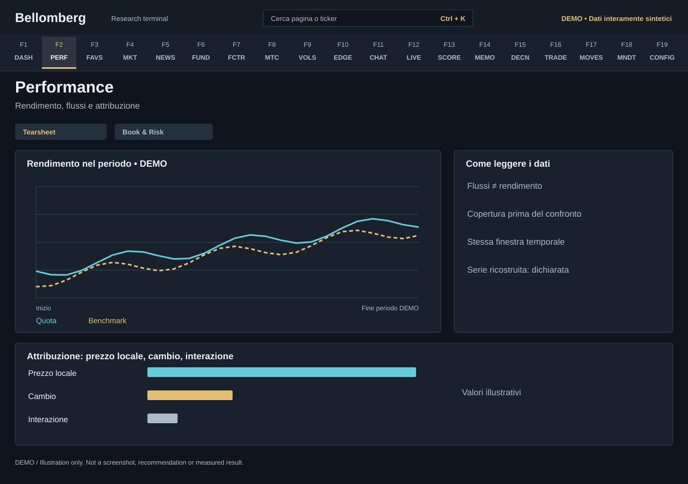

# F2 — Performance

[Handbook](../README.md) · [Previous: F1](./01-command-center.md) · [Next: F3](./03-watchlist.md)

*DEMO illustration: invented instruments, values and text; not a screenshot.*

Use this page to distinguish investment results from the money you contributed.
The **Tearsheet** and **Book & Risk** views combine returns, benchmark comparisons,
attribution and portfolio statistics. Availability depends on saved history and
the providers needed by each calculation.

## Use it
1. Choose the date window before comparing any figures.
2. Read the portfolio curve alongside the benchmark and their respective
   coverage. A short overlapping history is not a full-period comparison.
3. Compare time-weighted return with wealth and capital flows. A deposit belongs
   in the ledger; it should not be interpreted as investment skill.
4. Inspect attribution for its own period: MTD, a rolling window, YTD and
   inception need not match the main chart selection.
5. Read the local-price, FX and interaction contributions together. Check the
   reported reconstruction or reconciliation basis before adding numbers.
6. Open Book & Risk for concentration, drawdowns and distribution statistics.

## Read the result
The coverage panel reports the first trade, first NAV snapshot, start of the
official series, trades before the first snapshot and calendar days without a
snapshot. Adding a historical execution does not create past NAV observations
or reconstruct an unknown cash history. Read the FX basis of IRR separately.

When opening positions have been declared, coverage begins with eligible
snapshots after registration of all opening balances. Earlier or unverifiable
snapshots are excluded and counted in the coverage note. The date a balance was
known is not an acquisition date. Historical purchase returns are unavailable;
IRR also requires two subsequent snapshots. A newly registered opening balance
does not itself create either snapshot.

A carried or reconstructed series has a different evidential status from
observed daily valuations. The page's source and coverage labels matter as much
as the percentage. Periods with no valid starting valuation or insufficient
observations may be unavailable.

Risk ratios, correlations and drawdowns describe a sample and methodology;
they are not guarantees about the next period. Trading costs, timing and missing
data can change comparisons. Use [Movements](17-movements.md) to investigate a
cash-flow discontinuity and [Factor Lab](07-factor-lab.md) to examine exposures.
This is a research tearsheet, not a certified performance report.
