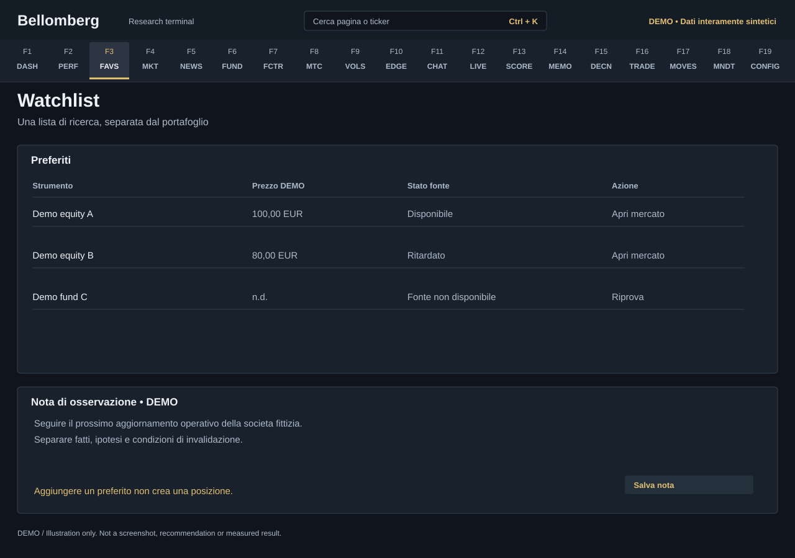

# F3 — Watchlist

[Handbook](../README.md) · [Previous: F2](./02-performance.md) · [Next: F4](./04-global-markets.md)

*DEMO illustration: invented instruments, values and text; not a screenshot.*

A watchlist is a place to keep research candidates without changing what you own.
It stores favourites and your observation notes, with quotes supplied separately.

## Use it
1. Find a security in [Global Markets](04-global-markets.md), confirm the venue
   and instrument, and add it to favourites.
2. Return here to compare the watched instruments.
3. Open an item for its market detail. Check the quote timestamp and currency.
4. Write an observation note and save it. Keep a versioned investment thesis in
   the [Journal](18-mandate-journal.md) when you need an audit trail.
5. Remove a favourite when it no longer belongs on this list.

## What changes
Adding or removing a favourite does not buy or sell the security. A watchlist
note does not create a portfolio position or a committee decision. Record actual
transactions through [Trade Entry](16-trade-entry.md).

## When data is missing
A saved favourite can remain valid while its current quote is unavailable.
A provider failure is not evidence that the instrument was deleted or that the
price is zero. Confirm the symbol and venue in Global Markets before changing
your saved entry.

The mock below deliberately uses invented instrument names. It illustrates a
research queue; it is not a suggested watchlist and none of its values are
loaded into a new installation.
