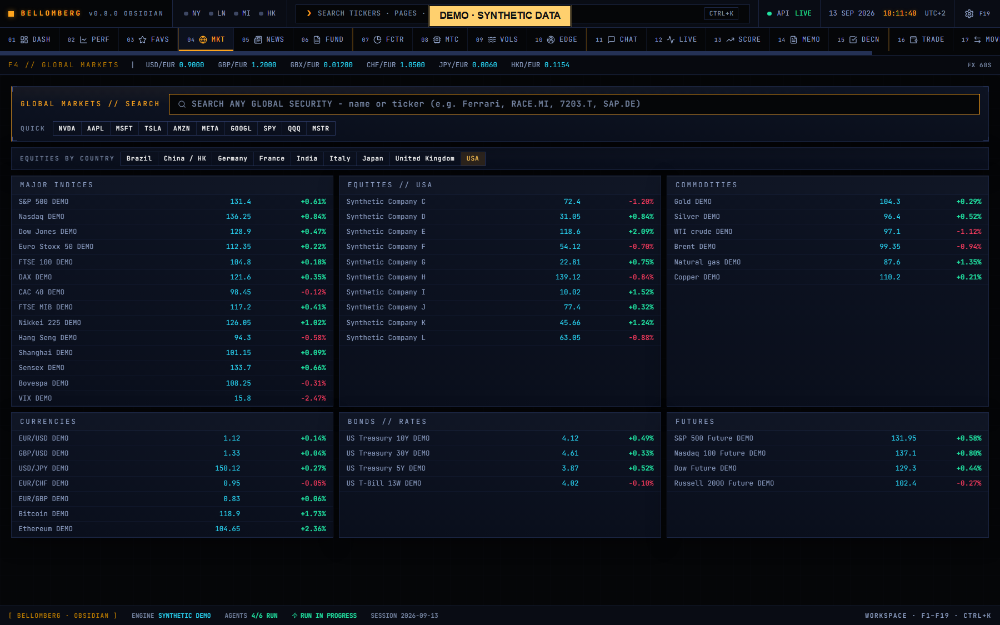
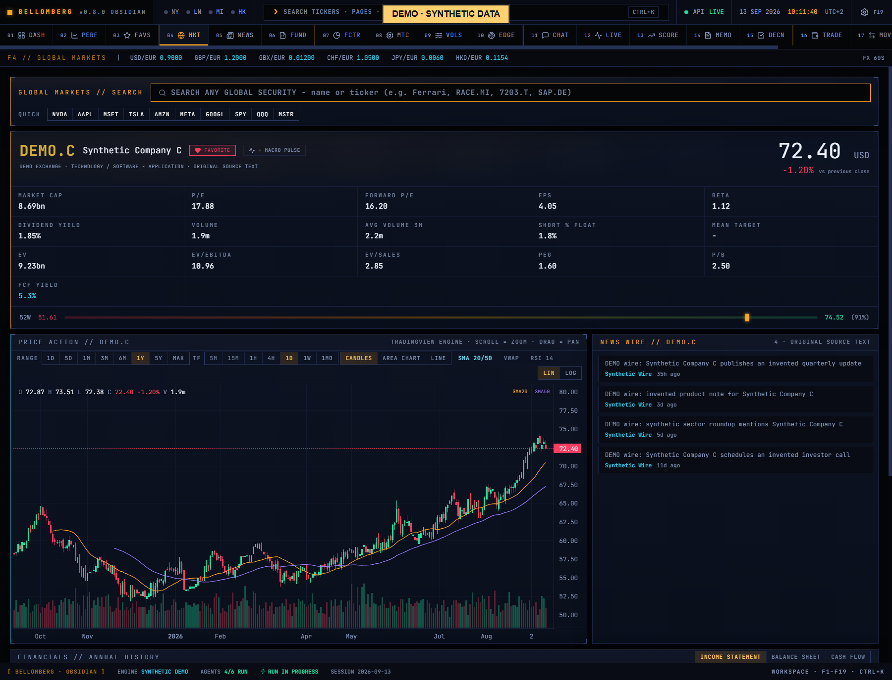
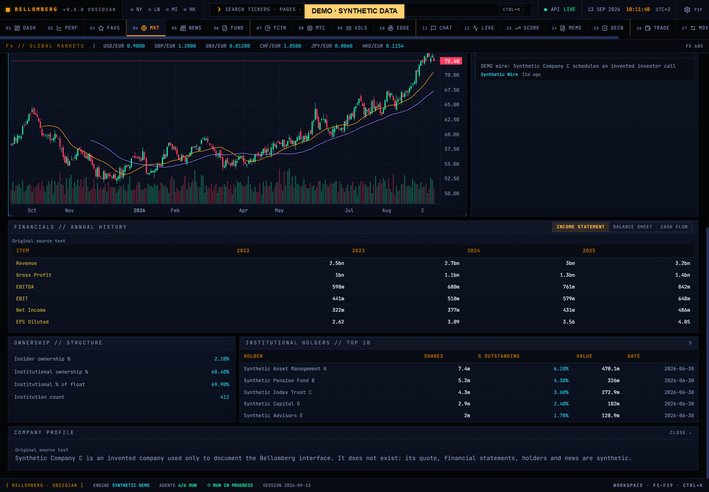

# F4 — Global Markets

[Handbook](../README.md) · [Previous: F3](./03-watchlist.md) · [Next: F5](./05-news-desk.md)

*English app screenshot with invented DEMO data. Analytics and histories are
authored synthetic snapshots, not results measured on a real account.*

Search an instrument, confirm its identity, then move from market context to
company detail. This is also where a portfolio holding or command-palette ticker
action can take you.

## Use it
1. Enter a name or ticker. Select the exact result, including the correct venue
   and currency; similarly named listings are not interchangeable.
2. Inspect the quote and the provider's timestamp. A page fetch time does not
   necessarily mean the exchange quote is real time.
3. Choose a chart period and the available candle, area or line view.
4. Add chart studies such as moving averages, VWAP or RSI where supported.
   Linear and logarithmic axes tell different visual stories.
5. Inspect income statement, balance sheet, cash flow, ownership and news
   sections as available for that instrument.
6. Save a favourite to [Watchlist](03-watchlist.md) or select instruments for
   Macro Pulse when using those controls.

*An invented company with its synthetic chart, ownership and news.*

*Financial statements and comparisons from the same invented company.*

## Read the result
A chart study is derived from the selected data; it is not an independently
verified signal. Company accounts have reporting periods, units and currencies
that may differ from the listing quote. A fund, bank and ordinary operating
company do not share the same meaningful fundamental fields.

Missing coverage should lead you to another source or a narrower question.
Check identity and units before using a figure in a valuation or trade. For
options, open [Vol Deck](09-vol-deck.md) and explicitly load its catalogue;
a price chart is not an options-chain subscription.
