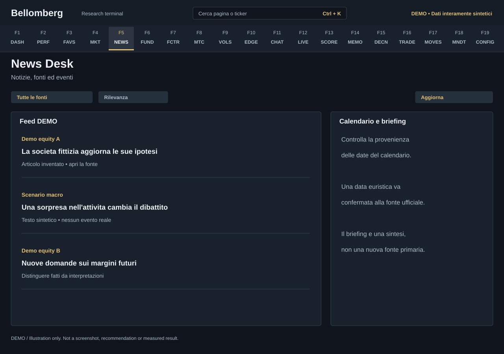

# F5 — News Desk

[Handbook](../README.md) · [Previous: F4](./04-global-markets.md) · [Next: F6](./06-fundamentals.md)

*DEMO illustration: invented instruments, values and text; not a screenshot.*

Read the news relevant to your book and research interests, then open the source
before relying on a headline. News refresh and generated briefings depend on
configured services; they can consume provider quota or AI credits.

## Use it
1. Narrow the feed with the available relevance, date, topic, provider or
   sentiment controls.
2. Read the publication time and source. Several headlines can refer to the
   same event or repeat an earlier report.
3. Open the original article for context and distinguish reported facts from a
   summary or classification.
4. Refresh deliberately when you need a newer feed. Inspect errors and stale
   content if a provider cannot respond.
5. Read a briefing as a synthesis to investigate, not as a replacement for its
   source material.

## Calendars need source checks
Event calendars can combine provider data and recurring-date heuristics.
Some economic calendar entries are generated from scheduling rules rather than
an official live release calendar. Confirm the precise date, time zone and
release with the relevant institution before planning around an event.
An issuer can also reschedule earnings.

## Keep research separate from evidence
Sentiment and relevance classifications help triage a feed. They are not measured
price forecasts and can be wrong. A quiet feed does not prove no important event
occurred. Save a developing macro view in the [Journal](18-mandate-journal.md);
ask a specialist in [Agent Chat](11-agent-chat.md) when you want a sourced,
domain-specific interpretation.
