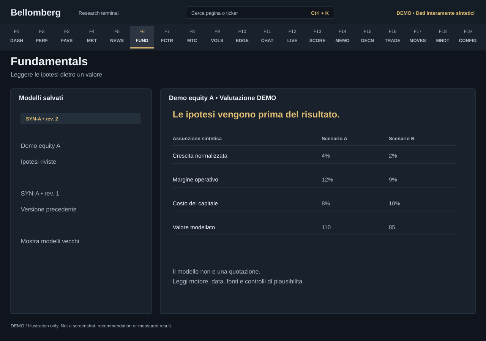

# F6 — Fundamentals

[Handbook](../README.md) · [Previous: F5](./05-news-desk.md) · [Next: F7](./07-factor-lab.md)

*DEMO illustration: invented instruments, values and text; not a screenshot.*

Inspect saved valuation models, their assumptions and the distance between a
modelled value and a market quote. This page is a model library and viewer;
opening it does not by itself generate a new valuation.

## Use it
1. Select an available model for an instrument.
2. Compare the displayed model date, price, fair value and revision. An old
   valuation and a fresh quote do not share the same observation time.
3. Read the engine and assumptions before interpreting upside. Different
   businesses can use bank/insurance, regulated-asset, holding-company, NAV,
   sum-of-parts or operating-company approaches.
4. Inspect the model's sanity checks and the intermediate assumptions. A result
   that exists can still be economically implausible.
5. Show older models when you need to compare revisions and explain why a view
   changed. Review the underlying report or workbook where available.

For a documented method, inspect the method decision, evidence, unresolved input
tasks and usability status together. The current canonical analysis takes
precedence over a merely newer file modification time. A changed workbook,
missing or unreadable sidecar, or discordant identity cannot revive an
unverified fair value from a saved snapshot. Blocked values and upside remain
unavailable; intermediate source fields may still be shown for investigation.
See the [documented valuation methods](../sector-valuations.md).

Changing interface language rereads the model list for current descriptions.
It does not regenerate calculations, translate a saved thesis, or rewrite an
existing workbook or report.

## If the library is empty
Generate research through the committee or a supported valuation tool request,
then return to the saved models. The optional maintenance script lives at
[tools/ops/rigenera_modelli.py](../../../tools/ops/rigenera_modelli.py); inspect its
usage and provider requirements before running it. There is no promise that
every ticker is classifiable or supported.

Private instrument classification and look-through metadata can be required.
A missing classification should be resolved explicitly; a convenient default
engine can give a misleading answer.

A fair value is a scenario output, not an observed price or target guaranteed
to occur. Record your own assumptions and what would invalidate them in the
[Journal](18-mandate-journal.md).
