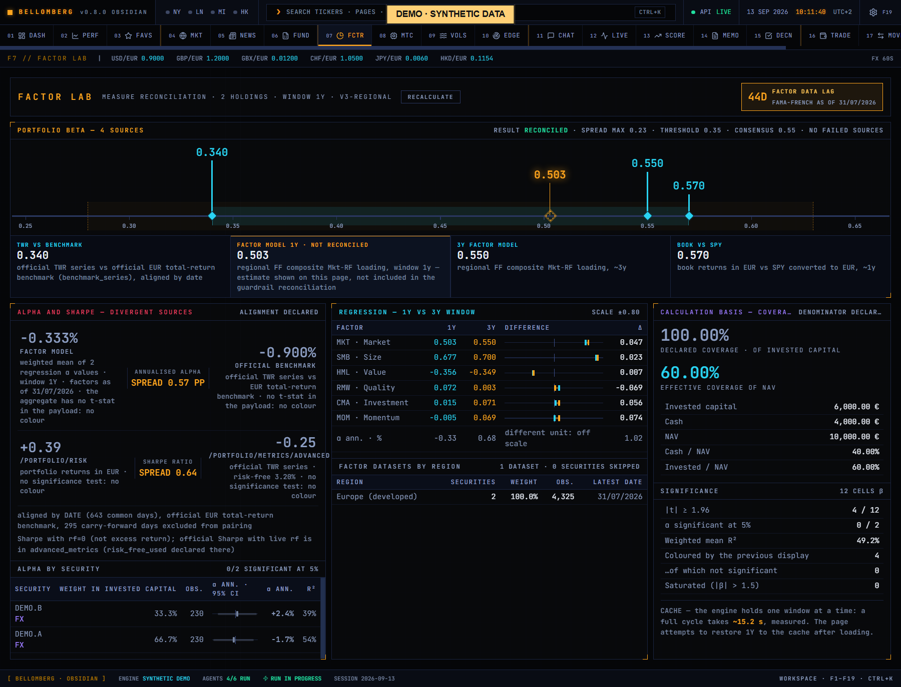

# F7 — Factor Lab

[Handbook](../README.md) · [Previous: F6](./06-fundamentals.md) · [Next: F8](./08-monte-carlo.md)

*English app screenshot with invented DEMO data. Analytics and histories are
authored synthetic snapshots, not results measured on a real account.*

Investigate exposures shared by holdings that may look diversified by name.
Factor Lab combines portfolio risk measures, estimated factor exposures and
reconciliation views. These are statistical descriptions of available data.

## Use it
1. Check the sample window, coverage and source status before comparing factors.
2. Review portfolio-level risk and the contribution or loading views.
3. Inspect the reconciliation of beta estimates where provided; estimates from
   different windows or methods need not agree.
4. Compare the available longer-period view with the current book. A current
   portfolio reconstructed through history is different from your actual traded
   portfolio over that time.
5. Use the result to formulate a scenario in [Monte Carlo](08-monte-carlo.md) or
   a question for the Quant desk in [Agent Chat](11-agent-chat.md).

## Read the result
A loading measures a relationship in the estimation sample. It is not a fixed
property of a company, a causal explanation or a prediction that a factor will
pay off. Thin histories, missing returns and correlated factors reduce the
strength of an interpretation.

Fund or holding-company exposures depend on the underlying metadata and its
coverage. Do not assume universal look-through to every underlying asset.
Inspect currency, concentration and direct holdings alongside estimated factors.

If reconciliation fails or an estimate is unavailable, preserve that uncertainty.
Do not sum incompatible measures merely because they are displayed on the same
page. Use [Performance](02-performance.md) for realised portfolio history.
