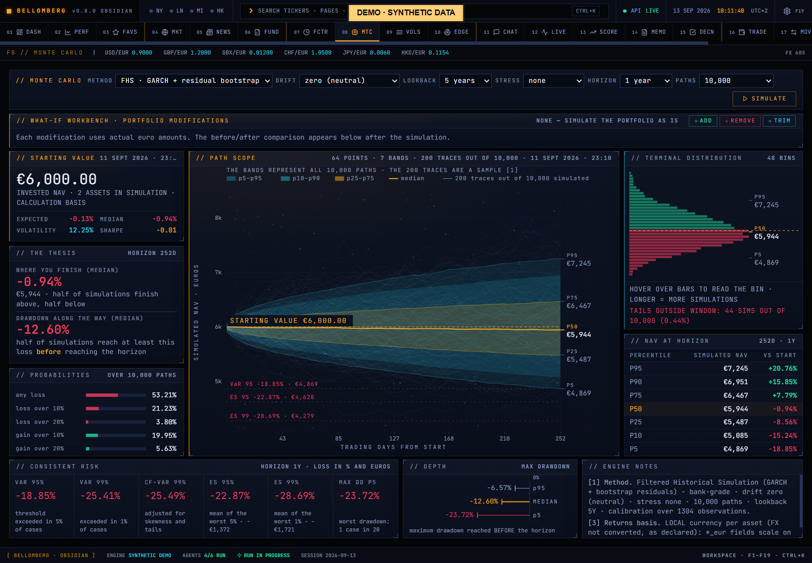

# F8 — Monte Carlo

[Handbook](../README.md) · [Previous: F7](./07-factor-lab.md) · [Next: F9](./09-vol-deck.md)

*English app screenshot with invented DEMO data. Analytics and histories are
authored synthetic snapshots, not results measured on a real account.*

Explore how a proposed portfolio modification changes a modelled distribution.
The page's route retains its older name, but its current purpose is Monte Carlo
scenario analysis. It does not execute trades.

## Use it
1. Start from the current book and inspect the available input history.
2. Add a hypothetical instrument, remove one, or trim an existing exposure using
   the scenario controls. Confirm the exact symbol and the units the field asks
   for; quantity, weight and cash amount are different inputs.
3. Set the available horizon and simulation assumptions.
4. Run the comparison and inspect the baseline and modified distributions.
5. Hover the chart to inspect the bands and compare downside as well as central
   outcomes. Keep the assumptions with any conclusion you record.

Each scenario row keeps the numeric format selected when that row was added.
Changing interface language preserves the entered text and its interpretation,
including when you continue editing it. Check the field's format hint and the
parsed amount; ambiguous input is rejected. The language switch alone does not
run a simulation or change an existing result.

## What the chart means
A percentile band is conditional on the chosen model and its inputs. It is not
a confidence statement that the future must follow those paths. Historical
volatility and relationships can change; extreme events, liquidity constraints
and trading frictions may not be captured by the simulation.

An invalid symbol or inadequate history should be resolved before interpreting a
comparison. A prettier curve is not evidence that a strategy is executable or
suitable for your mandate.

The scenario remains hypothetical. If you later execute a trade independently,
record the actual transaction in [Trade Entry](16-trade-entry.md). Save your
reasoning in the [Journal](18-mandate-journal.md) to compare it with later evidence.
