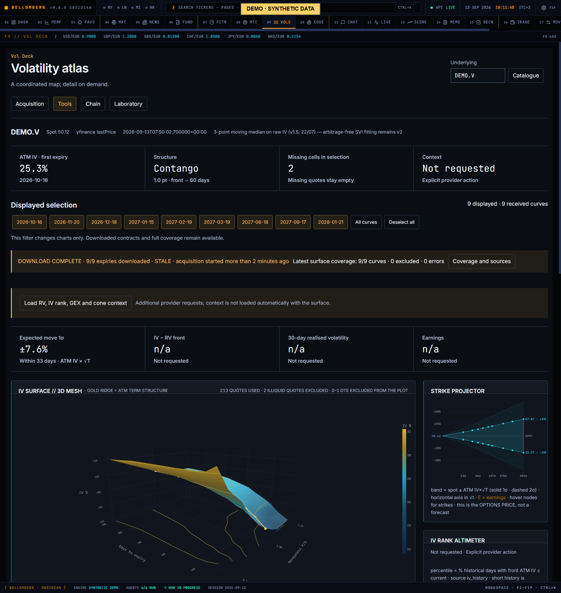
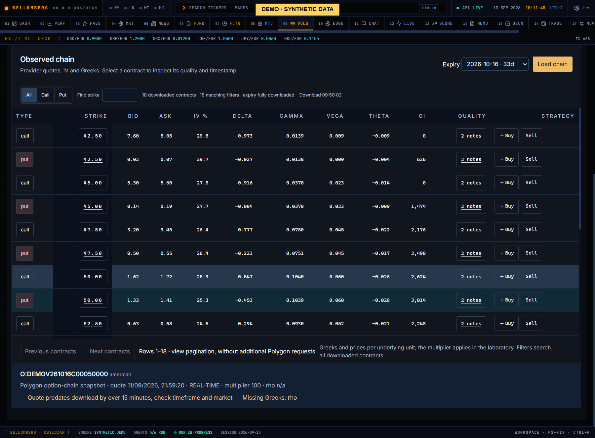
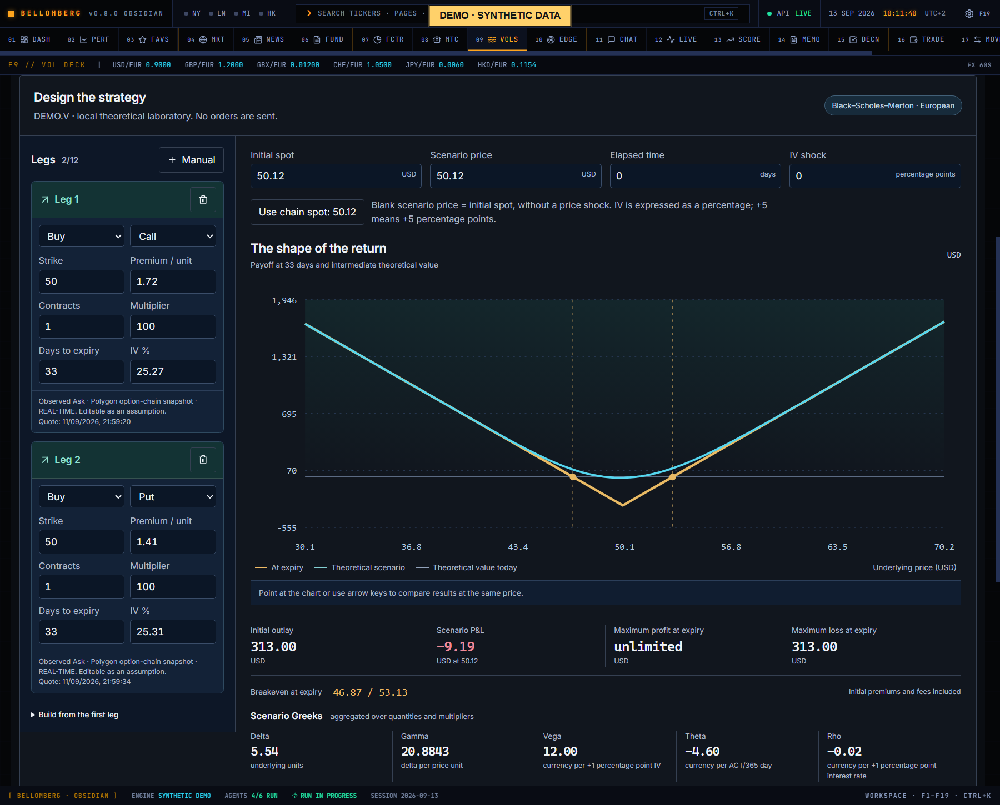

# F9 — Vol Deck

[Handbook](../README.md) · [Previous: F8](./08-monte-carlo.md) · [Next: F10](./10-edge-scanner.md)

*English app screenshot with invented DEMO data. Analytics and histories are
authored synthetic snapshots, not results measured on a real account.*

The [workflow illustration](../../assets/product/09-vol-deck.svg) is a separate,
simplified diagram with Italian labels.

Vol Deck has four tabs below the **Underlying** (*Sottostante*) field. Controls
are named here by their English label, with the Italian interface label in
parentheses at first mention. The workflow keeps catalogue coverage, observed
contracts and theoretical strategy values separate.

| Tab | What it contains |
| --- | --- |
| **Acquisition** (*Acquisizione*) | Expiry catalogue, horizon, download progress, coverage and download errors |
| **Tools** (*Strumenti*) | 3D surface, smile section, term structure, derived panels and optional context |
| **Chain** (*Chain*) | Downloaded contracts with quotes, IV, Greeks and a contract inspector |
| **Laboratory** (*Laboratorio*) | Strategy legs, scenario inputs, payoff chart and heatmap |

After a surface is built, a provenance line (ticker, spot and its source, snapshot
time, smoothing method) and four headline figures stay above every tab: ATM IV of
the first expiry, term structure, missing cells in the displayed selection and
context status.

## Load the expirations you need
1. Enter the exact ticker and press **Catalogue** (*Catalogo*). The page opens
   **Acquisition** and reads the catalogue for that ticker. No portfolio ticker
   or chain is fetched merely by opening the page.
2. The catalogue loads progressively until the provider confirms its end.
   **Pause catalogue** (*Interrompi catalogo*) stops discovery; **Resume catalogue**
   (*Riprendi catalogo*) continues from the last date received; **Reload**
   (*Rileggi*) reads it again from the start.
3. Choose **Final expiry** (*Scadenza finale*), or use the **1 month**, **3 months**,
   **6 months** and **1 year** shortcuts. Every available date up to that boundary
   is included, including contracts expiring today. **Full chain** (*Intera chain*)
   selects the entire catalogue, including distant expirations and 0DTE.
   **Expiry list and coverage** (*Elenco e copertura delle scadenze*) expands the
   dates by month for inspection; there are no per-date checkboxes.
4. Press **Load chain and surface** (*Carica chain e superficie*). It stays
   disabled until the provider has confirmed the end of the catalogue, while the
   catalogue, a download or a surface request is in progress, and when the horizon
   contains no dates. Progress shows contracts, received pages and
   downloaded expiries. There is no total expiration or contract cap.
   **Pause download** (*Interrompi download*) keeps the response already in flight;
   **Resume download** (*Riprendi download*) continues from the saved cursor,
   including after a retryable provider error such as a rate limit.
5. When the download completes, the page builds the surface and switches to
   **Tools**. **Show received surface** (*Mostra superficie ricevuta*) builds one
   earlier from the contracts received so far, including while the download is
   paused. If a page fails, the download stops at that expiry and shows the error;
   resume it, or press **Show received surface**. If no surface can be built, the
   page stays in **Acquisition** with the reason. A preserved download reopened
   after changing ticker does not switch tabs by itself; use **Show received
   surface**.
6. Return to **Acquisition** to read **Latest surface coverage** (*Copertura
   dell’ultima superficie*): loaded, partial, excluded or error for every requested
   expiry, together with its reason. The other tabs show the same gaps in a
   **Coverage and sources** (*Copertura e fonti*) notice: catalogue and download
   errors, an unfinished or STALE download and every uncovered expiry with its
   reason. Its button returns to **Acquisition**.

This workflow applies to every underlying supported by your Polygon account.
An ETF ticker and an index ticker identify different contracts; the app does not
replace one with the other. Access failures remain explicit.

Download completeness and surface eligibility are separate. Snapshots are retained
in backend memory for one hour of inactivity and are lost on backend restart. A
download is marked **STALE** two minutes after acquisition started, or after its
oldest received page if that is earlier; complete does not mean real-time. Starting
a new download refreshes expired data. An unfinished download is paused when you
move to another ticker; returning to that ticker without leaving F9 offers the
preserved job.

A date in the catalogue is not proof of usable quotes at every strike. Zero- and
one-day expirations stay available in **Chain** but are excluded from the surface,
with that reason in coverage. The mesh leaves missing points open instead of
drawing an invented bridge across them. A sparse surface can be an honest account
of sparse data.

## Read the surface and its tools
Without a surface, **Tools** asks you to choose the underlying and acquire
expiries, with a button back to **Acquisition**.

1. Use **Displayed selection** (*Campione visualizzato*) to show or hide individual
   expiries, or press **All curves** (*Tutte le curve*) or **Deselect all**
   (*Deseleziona tutte*). This filter changes the charts only; downloaded contracts
   and full coverage remain available.
2. Drag the 3D mesh to rotate it and hover for exact K/S, days and IV; the gold
   ridge is the ATM term structure. Point at the smile section, or focus it and use
   the left and right arrow keys, to read every displayed expiry at the same K/S.
3. Read the derived panels: expected move, strike projector, ATM term structure,
   top-down heat map, ATM and 25Δ skew table, forward volatility between
   consecutive expiries, open interest by expiry and the desk reading note when the
   builder provides one. Check axes and units before comparing strikes or
   maturities.
4. Press **Load RV, IV rank, GEX and cone context** (*Carica contesto RV, IV rank,
   GEX e cone*) only when you want that context. It requests the current
   download's expirations again from the provider with context, replaces the
   displayed surface with that response and then reads the volatility cone.
   Until then, the IV − RV, realised-volatility and earnings figures, the IV rank
   altimeter, the volatility cone and gamma exposure state that context was not
   requested. After that request, coverage refers to it. Coverage can differ by
   panel.

## Inspect the chain and Greeks

*The Chain tab displays synthetic quotes, Greeks and contract details.*

1. Open **Chain**, or press **Chain, Greeks and strategies** (*Chain, greche e
   strategie*) in **Acquisition**. Choose a date in **Expiry** (*Scadenza*); the
   list is the catalogue and its first date is preselected.
2. If that expiry is already downloaded, its contracts load from backend memory,
   250 rows at a time; **Load chain** (*Carica chain*) reads them again. For an
   expiry not yet downloaded, **Load chain** starts a resumable download of that
   expiry alone. When it completes, its rows appear in **Chain**. If a surface can
   be built from that expiry alone, the page also switches to **Tools** and replaces
   the displayed surface. A 0–1 DTE or illiquid expiry cannot build one: the page
   stays in **Chain** and the reason appears in the **Coverage and sources** notice.
   The new download replaces the ticker's previous one. Expiries that only the
   previous download contained are downloaded again when you load them here, and a
   paused previous download can no longer be resumed: **Load chain and surface**
   starts it again from the beginning. The button stays disabled for an expiry not
   yet downloaded while another download is running.
3. Use **Previous contracts** (*Contratti precedenti*) and **Next contracts**
   (*Contratti successivi*) to page through the stored rows. Table pagination does
   not request more provider data.
4. Filter **All** (*Tutte*), **Call** or **Put**, or type in **Find strike**
   (*Cerca strike*). Filters search the entire downloaded expiry, including rows
   outside the visible page. Read bid, ask, IV %, delta, gamma, vega, theta and
   open interest.
5. Select a contract's type, strike or **Quality** (*Qualità*) cell to inspect its
   source, quote timestamp, timeframe, multiplier, exercise style, rho and quality
   notes. **n/a** (*n.d.*) is missing data.
6. Use **Buy** (*Compra*) or **Sell** (*Vendi*) to add a leg to **Laboratory**. A buy
   copies the ask and a sell copies the bid as premium only when bid and ask are
   present, not crossed and the ask is positive; otherwise the premium stays blank.
   The buttons are disabled for adjusted contracts and once twelve legs exist. They
   do not place an order or change portfolio holdings.

A retrieved contract may have a delayed, stale, crossed or incomplete market.
Its source timestamp is distinct from the time at which you calculated a
theoretical value. Prices and Greeks in the table are per underlying unit; the
multiplier applies in the laboratory. Check it; never assume every contract uses
the same one.

## Build a strategy

*The Laboratory tab displays an invented strategy and its authored scenario snapshot.*

Open **Laboratory** (*Laboratorio*). It also works without a ticker, from manual
assumptions. Create up to twelve legs with **Manual** (*Manuale*) or from the chain.
For each leg, supply direction, call/put, strike, **Premium / unit** (*Premio /
unità*, per underlying unit), contracts, multiplier, days to expiry and IV %.
Quantities are whole contracts. Legs and inputs stay while you switch tabs;
entering a different underlying clears them.

**Build from the first leg** (*Costruisci dalla prima gamba*) offers **Vertical
spread** (*Spread verticale*), **Straddle** and
**Calendar spread** (*Spread calendario*). Unknown premiums or volatility
assumptions remain for you to enter; a template does not manufacture an observed
quote.

Set **Initial spot** (*Spot iniziale*), **Scenario price** (*Prezzo scenario*),
**Elapsed time** (*Tempo trascorso*, days) and **IV shock** (*Shock IV*,
percentage points).
After loading a chain, **Use chain spot** (*Usa spot della chain*) fills both
prices. A blank scenario price equals the initial spot. Under **Model assumptions**
(*Ipotesi del modello*), set the annual rate, annual dividend yield, initial cost
per contract and common currency; they start at zero and USD as editable
assumptions, not market data. Use the fields' stated units, especially annual
rates, IV and days. Missing required inputs block the calculation.

Press **Simulate strategy** (*Simula strategia*). After any change the chart keeps
the last result, marked as outdated, until you press **Recalculate scenario**
(*Ricalcola scenario*).

## Read the laboratory
- **Gold:** payoff at expiration, available when all legs share an expiry.
- **Cyan:** the theoretical scenario after your time and IV changes.
- **Grey dashed:** today's theoretical curve.
- **If price changes as time passes** (*Se il prezzo cambia mentre passa il
  tempo*): a heatmap of the same model, with prices in columns and elapsed days in
  rows.

Point at the chart, or focus it and use the left and right arrow keys, to compare
values at the same price. Compare the initial outlay or credit, break-even levels,
maximum profit and loss at expiry or unlimited sides, and the scenario Greeks
aggregated over quantities and multipliers. For different expirations there is no
single common-expiry payoff; calendar scenarios stop at or before the first expiry.

## Model boundaries
The simulator uses European Black–Scholes–Merton, ACT/365 time, continuous
dividend yield and constant per-leg IV plus the chosen shock. Intermediate
values are theoretical. It does not model American early exercise, discrete
dividends or intraday expiration mechanics. **Method and limitations** (*Metodo e
limiti da leggere*), at the end of the tab, lists these limits.

Initial fees are included; slippage, exit costs, financing and tax are not.
A mathematically unbounded loss is not a calculated margin requirement.
Provider availability and quote quality remain separate from simulator
correctness. Record assumptions before treating a visual result as research.
The simulator runs locally and does not itself require an AI model call.
