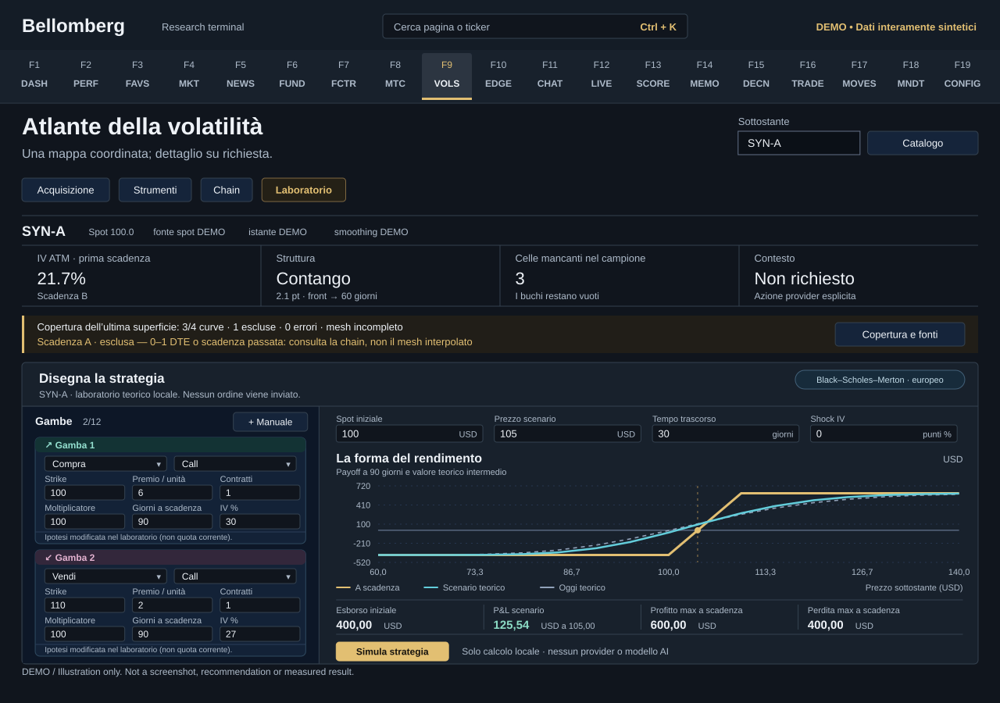

# F9 — Vol Deck

[Handbook](../README.md) · [Previous: F8](./08-monte-carlo.md) · [Next: F10](./10-edge-scanner.md)

*DEMO illustration: invented instruments, values and text; not a screenshot.*

Use three connected views: **Surface**, **Desk** and **Chain–Strategie**.
The workflow makes catalogue coverage, observed contracts and theoretical
strategy values visible as separate things.

## Load the expirations you need
1. Enter the exact underlying ticker and press **CATALOGO**. No portfolio ticker
   or full chain is fetched merely by opening the page.
2. Browse the month timeline. Each request retrieves a bounded part of the
   provider catalogue; use **Altre scadenze** until it reports completeness.
3. Inspect all listed dates, including zero- and one-day expirations.
4. Select up to eight expirations eligible for the mesh (at least two days to
   expiry), then press **Carica superficie selezionata**.
5. Read coverage for every requested expiry: loaded, partial, excluded or error,
   together with its reason.

A date in the catalogue is not proof of usable quotes at every strike. Zero- and
one-day dates stay visible even when excluded from the surface model.
The mesh leaves missing points open instead of drawing an invented bridge across
them. A sparse surface can be an honest account of sparse data.

## Read Surface and Desk
Rotate the surface and inspect the selected expirations, smile and term
structure. Check axes and units before comparing strikes or maturities.
Use **Carica contesto RV, IV rank, GEX, cone** when you also want that context;
those are additional data requests. Coverage can differ by panel.

## Inspect the chain and Greeks
1. Open **Chain–Strategie** and select an expiry from the catalogue.
2. Press **Carica chain**. The table loads up to 250 contracts per page; use
   **Carica altri contratti** when more are available.
3. Filter calls, puts or strikes. Read bid, ask, implied volatility, delta,
   gamma, vega, theta and open interest.
4. Select a contract to inspect its quality, source, quote timestamp, timeframe,
   multiplier and additional fields such as rho. **n.d.** is missing data.
5. Use **Buy** or **Sell** to add a leg to the simulator. These buttons do not
   place an order or change portfolio holdings.

A retrieved contract may have a delayed, stale, crossed or incomplete market.
Its source timestamp is distinct from the time at which you calculated a
theoretical value. Check its multiplier; never assume every contract uses the
same one.

## Build a strategy
You can create up to twelve legs manually or from the chain. For each leg,
supply direction, call/put, strike, days to expiry, quantity, multiplier,
premium **per underlying unit** and IV. Quantities are whole contracts.

Vertical, straddle and calendar templates start from your first leg. Unknown
premiums or volatility assumptions remain for you to enter; a template does not
manufacture an observed quote.

Set current spot, scenario spot, elapsed days, IV shock, rate, continuous
dividend yield, initial fees and currency. Missing required inputs block the
calculation. Use the field's stated units, especially annual rates, IV and days.

## Read the laboratory
- **Gold:** payoff at expiration, available when all legs share an expiry.
- **Cyan:** the theoretical scenario after your time and IV changes.
- **Dashed:** today's theoretical curve.
- **Price × time heatmap:** the same model across alternative scenarios.

Hover or use the chart's arrow controls to inspect values. Compare debit/credit,
break-even levels, maximum gain/loss or unbounded sides, and aggregated Greeks.
For different expirations there is no single common-expiry payoff; calendar
scenarios stop at or before the first expiry.

## Model boundaries
The simulator uses European Black–Scholes–Merton, ACT/365 time, continuous
dividend yield and constant per-leg IV plus the chosen shock. Intermediate
values are theoretical. It does not model American early exercise, discrete
dividends or intraday expiration mechanics.

Initial fees are included; slippage, exit costs, financing and tax are not.
A mathematically unbounded loss is not a calculated margin requirement.
Provider availability and quote quality remain separate from simulator
correctness. Record assumptions before treating a visual result as research.
The simulator runs locally and does not itself require an AI model call.
