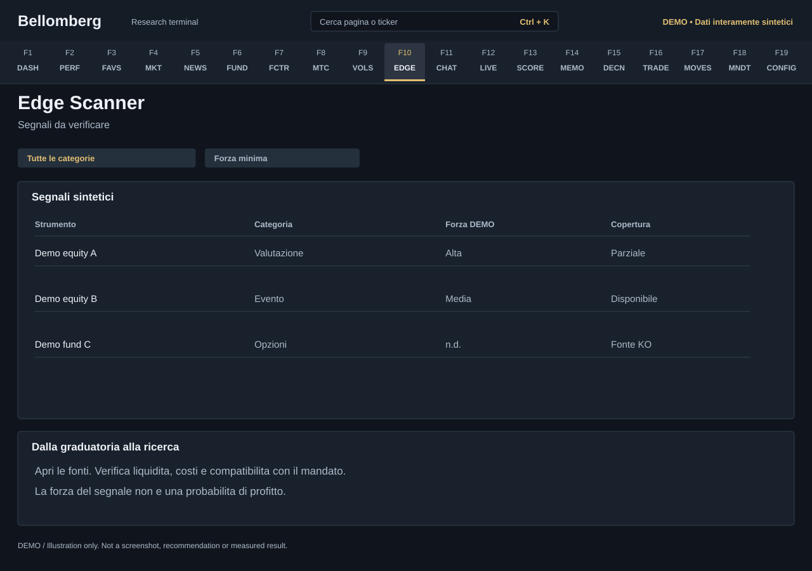

# F10 — Edge Scanner

[Handbook](../README.md) · [Previous: F9](./09-vol-deck.md) · [Next: F11](./11-agent-chat.md)

*DEMO illustration: invented instruments, values and text; not a screenshot.*

Use the scanner to find signals worth investigating. It presents candidate
signals by category and strength, with the evidence available from its sources.

## Use it
1. Review source availability and the time of the latest scan.
2. Select a category or narrow the minimum-strength filter.
3. Read each signal's evidence and instrument identity before comparing ranks.
4. Open the relevant market, fundamentals or options context to test the idea.
5. Ask the relevant specialist what would invalidate the signal, then record
   your reasoning if it becomes an investment thesis.

## Strength is not a probability
A ranking or strength score is a prioritisation rule, not a calibrated
probability of profit. Different signal families can have different definitions
and coverage. The scanner does not prove that a result survives transaction
costs, liquidity limits or an independent out-of-sample test.

Missing provider coverage can mean a category has no evaluable candidates.
A blank list does not automatically mean there are no opportunities, and a
populated list is not a recommendation to trade.

Compare a signal with your [mandate](18-mandate-journal.md), current exposures
and time horizon. The scanner changes no holdings. Keep a research hypothesis
in the Journal; use [Decisions](15-decisions.md) when responding to a saved
committee recommendation.
