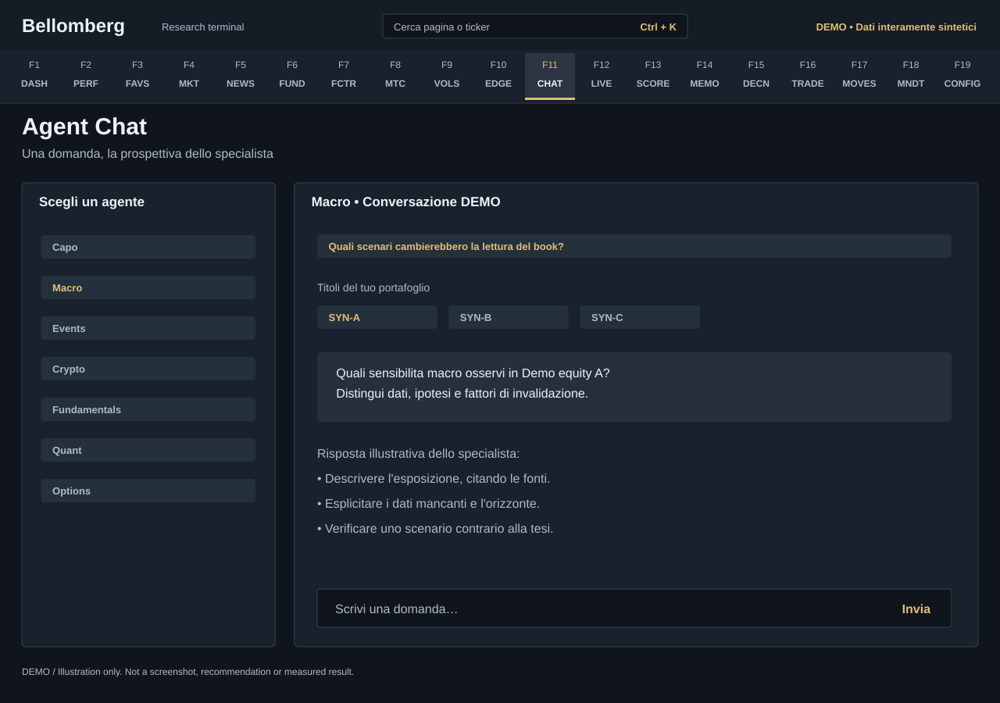

# F11 — Agent Chat

[Handbook](../README.md) · [Previous: F10](./10-edge-scanner.md) · [Next: F12](./12-agents-live.md)

*DEMO illustration: invented instruments, values and text; not a screenshot.*

Select a desk and ask a focused question. The current selector exposes the Capo
and specialist desks; older saved conversations can remain readable even if a
legacy desk is no longer offered for a new conversation.

## Use it
1. Choose the agent whose expertise matches your question.
2. Start with one of its predefined questions or write your own. A good request
   names the horizon, asks for sources and states what uncertainty matters.
3. Under the question suggestions, use the ticker chips from **your current
   portfolio**. Filter the list when it is long.
4. Clicking a ticker sends a question for that desk immediately. For example,
   Macro examines the instrument's macro sensitivities while another specialist
   focuses on its own domain. The chips are not a built-in recommendation list.
5. Read the streamed answer, source references and missing-data notices. Ask a
   follow-up to inspect assumptions or challenge the conclusion.

Each send captures its output language before the request starts. Changing
interface language during the reply does not change that answer mid-stream.
Saved messages show their original language when recorded, or an unknown-language
badge for legacy content. They are not translated or sent again when the
interface language changes. Your unsent question remains your original text.

## Longer replies
Chat allows longer answers through the configured per-call output budget.
The budget is measured in model tokens, not characters, and some providers count
reasoning within it. A configured maximum is not a promise that every response
will have that length: provider context limits, tool loops and model behaviour
still apply.

Longer text is not stronger evidence. Ask the agent to separate observations,
interpretation and unresolved questions. Do not infer a fresh quote merely from
the fact that an answer arrived now.

## Privacy and cost
Sending a question can call a remote model and enabled tools. Portfolio and
research context needed by the request can leave your computer for those
providers. Your keys, quota and billing apply.

Chat does not execute an order. A [Journal](18-mandate-journal.md) entry is not
automatically supplied to agents; explicitly choose any excerpt you want to
share. Use [Agents Live](12-agents-live.md) for a full committee run.
