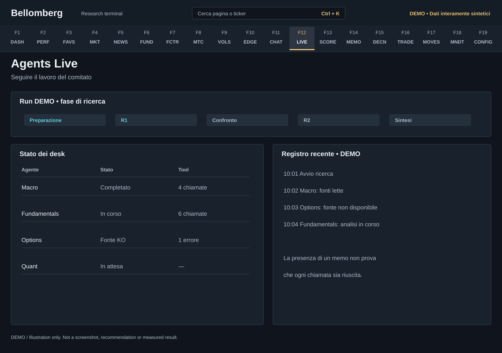

# F12 — Agents Live

[Handbook](../README.md) · [Previous: F11](./11-agent-chat.md) · [Next: F13](./13-agent-progress.md)

*DEMO illustration: invented instruments, values and text; not a screenshot.*

Follow the committee while it works: phases, agent state, tool activity and the
saved execution record. This is the operational view of a run, separate from
the eventual quality of its recommendations.

## Use it
1. Start a committee run only after checking your book, mandate, credentials and
   any configured output delivery. A run may use paid models and data sources.
2. Open this page to inspect the current phase and each desk's state.
3. Read the timeline and recent log for completed work, waiting tasks and errors.
4. Inspect tool activity and recorded cost or timing where available.
5. When the run finishes, open [Memo Archive](14-memo-archive.md), review
   [Decisions](15-decisions.md) and later inspect [Agent Progress](13-agent-progress.md).

The run captures its output language at launch. Changing the interface language
while it runs changes interface labels, not the active research output. Read the
run's recorded language; older runs may not declare it.

## Interpret execution carefully
Recent logs can be bounded; a visible short list is not a complete audit log.
Tool-call counts and distinct tools are different measures. Parallel desk
durations also cannot be added as though they ran sequentially.

A completed report can coexist with a failed provider call or incomplete desk.
Read the run's errors and coverage rather than treating a final document as
proof that every input succeeded. Recorded costs describe the observed
execution, not an independently guaranteed invoice.

If a run seems stalled, inspect its last update and backend logs before starting
another. Avoid duplicate runs while the first may still be active.
If you request a stop, read the observed backend state afterwards. A failed or
unconfirmed cancellation preserves the last observed state and reports the
problem; clicking Stop is not itself proof that the run ended.
A failed or incomplete run should not be assigned an invented score merely to
fill [Agent Progress](13-agent-progress.md).

Operational speed, report length and tool use are not investment performance.
For that, wait for supported outcomes and examine their uncertainty.
