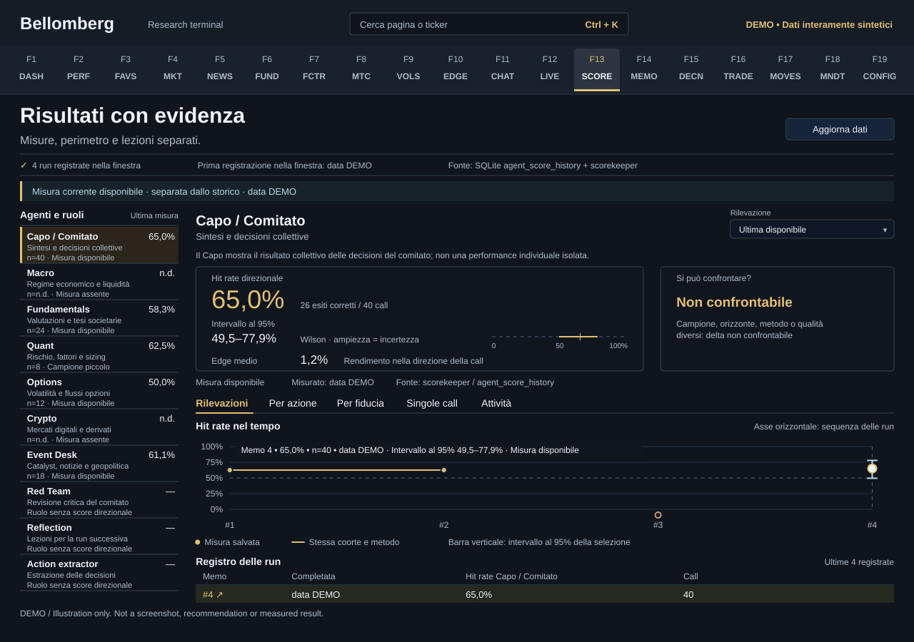

# F13 — Agent Progress

[Handbook](../README.md) · [Previous: F12](./12-agents-live.md) · [Next: F14](./14-memo-archive.md)

*DEMO illustration: invented instruments, values and text; not a screenshot.*

See what was actually saved about agents, runs and later outcomes. The page
helps distinguish execution progress, measured forecasting results and recorded
lessons. It is read-only; refreshing it does not launch a paid committee run.

## Use it
1. Select an agent and inspect the available run history.
2. Choose a run to see its recorded score snapshot, coverage and supporting
   detail.
3. Read the hit count and total observations alongside hit rate. Inspect the
   Wilson 95% confidence interval, average edge and other fields when available.
4. Compare runs only when the page identifies the same cohort and method.
   A delta is withheld when the comparison is not valid.
5. Review saved reflections or lessons and distinguish a proposed improvement
   from a change that has been implemented and measured.

## Why a score can be missing
Outcomes need time to mature and enough source data to be evaluated. A new
installation, recent run, unsupported role or missing historical snapshot can
have no score. The history view does not manufacture old snapshots or interpolate
across gaps.

The Capo can be associated with collective committee outcomes. That is not a
causal measurement of the Capo's individual contribution. A role without an
attributable scoring method should not receive an invented ranking.

## What “improvement” means here
A saved reflection proves that text was recorded. It does not prove that a code
or prompt change was applied, nor that a later gain was caused by it.
This is not automatic model training or fine-tuning.

Small samples produce wide uncertainty. Changes in market regime, sample
composition, horizon or scoring method can move a score without any genuine
skill change. Follow the saved evidence, compare like with like, and keep
unmeasured claims separate from measured outcomes.
