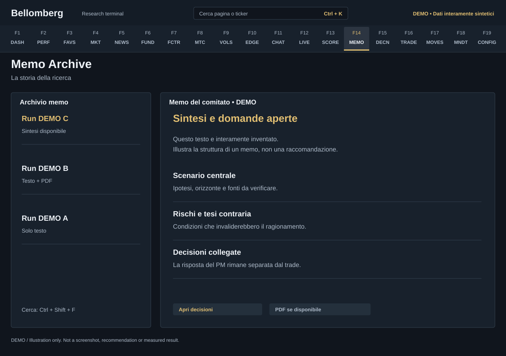

# F14 — Memo Archive

[Handbook](../README.md) · [Previous: F13](./13-agent-progress.md) · [Next: F15](./15-decisions.md)

*DEMO illustration: invented instruments, values and text; not a screenshot.*

Read saved committee memos, compare runs and recover the reasoning behind a
decision. The archive is a historical record: yesterday's report does not become
current merely because you opened it today.

## Use it
1. Select a run by date and inspect its available memo.
2. Use section navigation or the archive's text search. The search shortcut is
   **Ctrl+Shift+F** where provided.
3. Inspect the specialist reasoning, synthesis, sources and declared gaps.
4. Open linked decisions and outcomes for the same run.
5. Download or open the PDF and valuation appendix when that output exists.

## Availability and counts
The page reports records with neither readable content nor an available PDF in
the returned sample, up to 200 records. That is a row-level observation, not a
count of failed runs. The readable memo list has its own limit, so subtracting
the two list lengths would not establish how many memos are missing.

A PDF, appendix and saved text can have different availability after an
interrupted run. Do not assume all attachments exist because the memo text is
present. Inspect the run state in [Agents Live](12-agents-live.md) before retrying
an expensive generation.

The original-language badge describes the saved output when known. A legacy
record without language metadata remains unknown. Changing interface language
updates labels and tooltips while preserving the selected memo, search text and
original document; it does not request a fresh generation or translate the PDF.

## Use the archive as evidence
Read a source tag in its context and date. An old model output is not a live
provider quote. Compare successive memos to see what changed in the thesis,
inputs or recommendation.

Respond to actionable recommendations in [Decisions](15-decisions.md). Record
your own independent thesis in the [Journal](18-mandate-journal.md), where each
save preserves a revision. Exported memos and PDFs can contain your positions
and views; they belong with your private research, not public screenshots.
