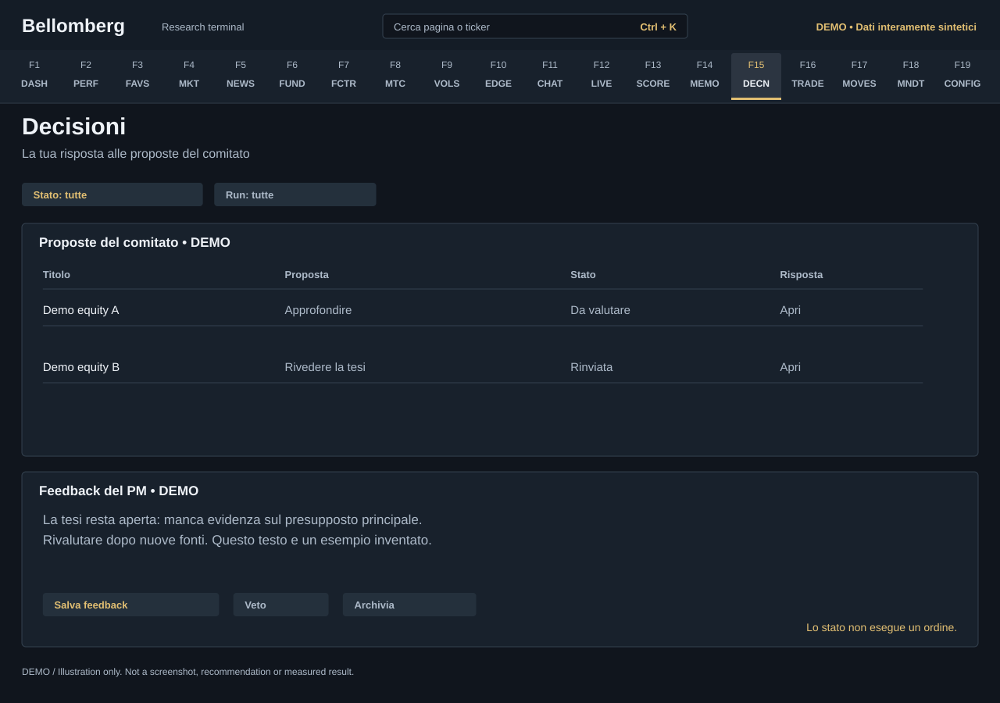

# F15 — Decisions

[Handbook](../README.md) · [Previous: F14](./14-memo-archive.md) · [Next: F16](./16-trade-entry.md)

*DEMO illustration: invented instruments, values and text; not a screenshot.*

Track your response to committee recommendations. Decisions are a research
workflow; marking a recommendation executed does not create a trade in the
portfolio ledger.

## Use it
1. Filter the list by status or the available run context.
2. Open a recommendation and inspect its date, rationale and evidence.
3. Record the status that reflects your actual response.
4. Add feedback explaining why you accepted, deferred or rejected the idea.
5. Use veto, revoke-veto, archive or reopen controls when appropriate, retaining
   the reason for the change.
6. If you executed a trade independently, record its actual fill in
   [Trade Entry](16-trade-entry.md).

## Feedback has a different role from the Journal
Decision feedback and research notes are part of the committee's decision
context and may be used by a later run. Be explicit about whether a statement
is a factual correction, a personal preference or an investment hypothesis.

The [Journal](18-mandate-journal.md) is for private writing and revision history.
It is not automatically ingested by agents. Keep a thought there until you
choose to share it when that distinction matters.

## Read outcomes cautiously
An observed outcome must match the recommendation's horizon, instrument and
method. A profitable holding is not, by itself, proof that the original reasoning
was right. Inspect [Agent Progress](13-agent-progress.md) for the available
scoring context and sample size.

Archiving removes an item from the active workflow; it should not be mistaken
for deleting the corresponding trade, cash movement or history.
