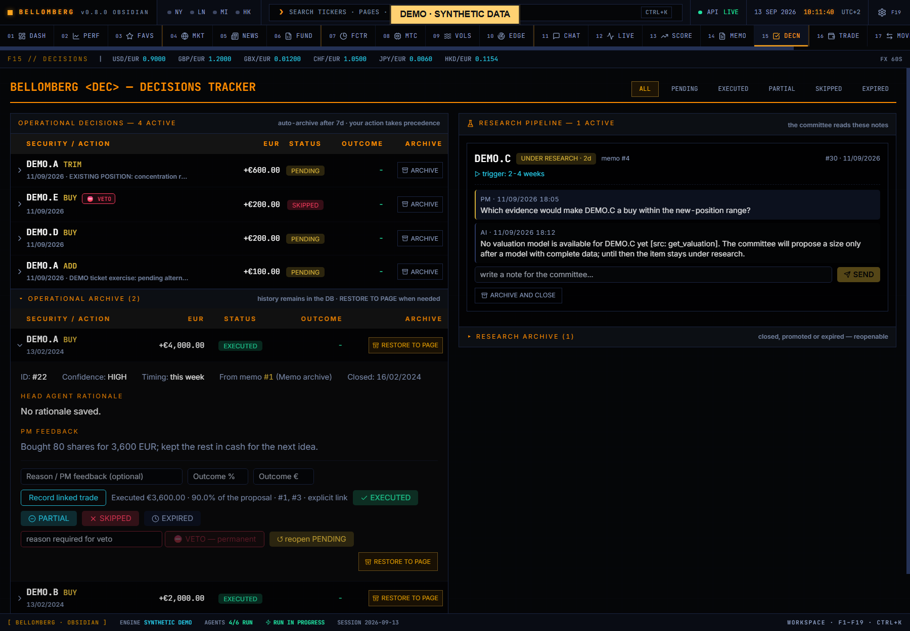

# F15 — Decisions

[Handbook](../README.md) · [Previous: F14](./14-memo-archive.md) · [Next: F16](./16-trade-entry.md)

*English app screenshot with invented DEMO data. Analytics and histories are
authored synthetic snapshots, not results measured on a real account.*

Track your response to committee recommendations. Decisions are a research
workflow; marking a recommendation executed does not create a trade in the
portfolio ledger.

## Use it
1. Filter the list by status or the available run context.
2. Open a recommendation and inspect its date, rationale and evidence.
3. Record the status that reflects your actual response.
4. Add feedback explaining why you accepted, deferred or rejected the idea.
5. Use veto, revoke-veto, archive or reopen controls when appropriate, retaining
   the reason for the change.
6. For an eligible BUY/ADD/SELL/TRIM recommendation, use **Record linked
   transaction** to open [Trade Entry](16-trade-entry.md) with its ID, ticker and
   direction. Enter the actual fill; quantities and prices are not guessed.

Multiple fills can link to the same decision. The detail reports cumulative
execution and its share of the proposed amount when calculable. The decision's
status remains under your control. A timestamp-based inference is labelled and
is weaker evidence than an explicit link; conventional times and ambiguous ties
do not justify an automatic attribution.

Saved rationales, feedback and notes retain their original wording. Interface
labels can change language without rewriting a recommendation or changing its
link to recorded executions.

Outcome fields keep the numeric format selected when you opened the detail.
Switching interface language, including before further typing, does not
reinterpret the amount; inspect the field's format hint and validation message.

## Feedback has a different role from the Journal
Decision feedback and research notes are part of the committee's decision
context and may be used by a later run. Be explicit about whether a statement
is a factual correction, a personal preference or an investment hypothesis.

The [Journal](18-mandate-journal.md) is for private writing and revision history.
It is not automatically ingested by agents. Keep a thought there until you
choose to share it when that distinction matters.

## Read outcomes cautiously
An observed outcome must match the recommendation's horizon, instrument and
method. A profitable holding is not, by itself, proof that the original reasoning
was right. Inspect [Agent Progress](13-agent-progress.md) for the available
scoring context and sample size.

Archiving removes an item from the active workflow; it should not be mistaken
for deleting the corresponding trade, cash movement or history.
Closing a RESEARCH item excludes it from subsequent runs; it does not stop a
committee process already in progress. Reopening it makes it eligible for a
later run again.
