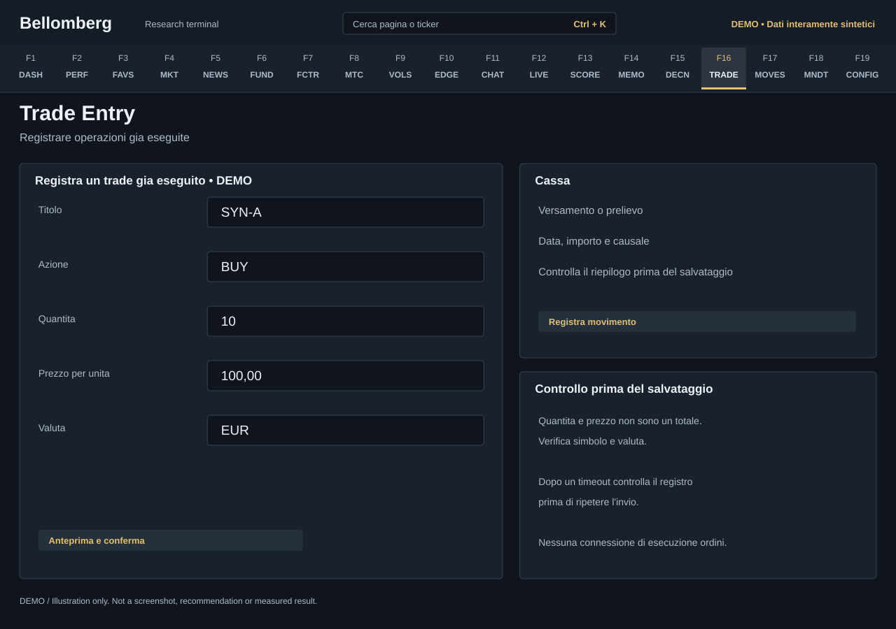

# F16 — Trade Entry

[Handbook](../README.md) · [Previous: F15](./15-decisions.md) · [Next: F17](./17-movements.md)

*DEMO illustration: invented instruments, values and text; not a screenshot.*

Choose explicitly between **Trade** and **Opening position**. Transactions
record what you actually executed and include the cash controls. An opening
position documents an already-held balance with incomplete purchase history.
Bellomberg is not sending an order to a broker from this page.

Each quantity, price or cash-amount field captures its number format at the first
non-empty entry. Changing interface language preserves that format, including
further edits; the field hint identifies it. Clearing the field starts a new
entry in the current language. Opening quantity and cost capture their formats
separately. Review the parsed preview before confirming.

## Declare an opening position
1. Choose **Opening position** and enter the exact ticker, positive quantity,
   average cost and quote currency. A documented zero cost is allowed; a negative
   cost is not. Name and your original note are optional.
2. Enter the **Balance known as of** date and its source. Choose day precision
   unless the document records a time. This date is not an acquisition date.
3. Request the read-only preview. Check the same values, provenance, coverage
   note and absence of a cash change before confirming once.
4. Read the receipt and reopen the saved record in the opening-position register.
   Verify the returned ID, source, date precision and amounts.

The preview lasts 120 seconds and confirmation uses that frozen request. A
changed book or expired preview requires a new preview; a server error or lost
acknowledgement requires readback before another attempt. Do not automatically
repeat an uncertain confirmation.

This workflow creates no BUY, cash movement or historical NAV observation and
does not fetch an acquisition FX rate. Earlier purchases and returns remain
unknown. Performance coverage begins with eligible snapshots after registration
of all opening positions; declaring the balance does not reconstruct the earlier
period. A second declaration for an already-recorded ticker is not an update
mechanism. Switching the two forms preserves their drafts in the current page
session; unsaved drafts are not durable backups.

## Record a trade
1. Choose **Trade**, then select the exact ticker and action: BUY, ADD, TRIM, SELL or
   DIVIDEND.
2. Enter the quantity, execution price and currency requested by the form.
   Review decimal separators and the resulting preview before confirming.
3. For a dividend, enter the number of shares and cash in **EUR per share**.
   The currency is locked to EUR for this action. Do not paste a total dividend
   amount or a market price into the per-share field.
4. Optionally enter the execution date and time. A blank date means now; a date
   without a time uses noon explicitly marked **conventional, not measured**.
   Future dates are rejected.
5. Select an explicit compatible decision, **manual without a decision**, or
   **relationship not declared**. The last option is not an explicit link.
6. Request the preview and review the execution date, FX source, current cash
   balance and any chronological recalculation, then confirm.
7. Check the result in [Movements](17-movements.md) and reconcile the portfolio.

## Historical executions
The preview reads the ledger without inserting a trial transaction. Confirmation
uses the same request and the FX shown in that preview; it expires after two
minutes. If cash, the position, its trades or the selected decision change,
request a new preview before confirming.

A backdated transaction can change current average cost and the realised result
of subsequent sales. The dialog shows the before/after quantities, opening date,
cost and realised result in the position's **quotation currency**, with the
affected trade IDs. An incomplete or inconsistent history is rejected rather
than filled with an invented opening position.

Historical FX is used when available. Otherwise the preview explicitly labels
current FX used for the current cash balance; a historical realised-EUR amount
without an appropriate rate remains unavailable. Previous NAV snapshots are not
rewritten. Entering an actual historical execution is different from merely
declaring a starting holding; do not invent a BUY to represent an unknown history.

## Record cash
Use the deposit/withdrawal controls for capital flows. Preview the amount, date
and reason, then confirm. An opening deposit establishes your starting capital;
a later contribution is not trading profit.
Before the first deposit, cash is explicitly uninitialized. A zero displayed
with that warning is not a measured balance; verify SQLite's saved amount and
declared source after initialization.

If a request times out or receives a server error after submission, inspect the ledger before repeating
it. A missing acknowledgement does not prove that a transaction failed, and
repeating a successful request can duplicate it.

## CSV imports are a separate workflow
The optional [CSV importer](../../../tools/ops/importa_trade_csv.py) accepts
columns data, ticker, azione, quantita, prezzo, valuta and note. Review
[its synthetic example](../../../tools/ops/esempio_trade.csv) before adapting a
copy. The script defaults to a preview; application requires its explicit flag.

The importer is **not equivalent to this page's cash-aware transaction flow**:
it does not update cash automatically, and legacy realised-EUR values can require
separate reconstruction. Even preview constructs the database abstraction and
can apply schema migrations. Applied imports back up the database and refuse an
active backend, but a multi-row failure can leave partial progress.
Reconcile before retrying; never experiment on your only live database.

For an existing cash ledger, do not repeat an opening-cash migration just because
the application was updated.
