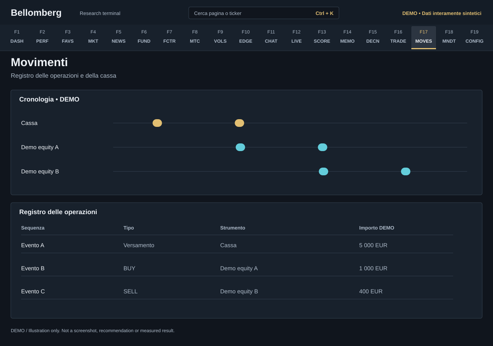

# F17 — Movements

[Handbook](../README.md) · [Previous: F16](./16-trade-entry.md) · [Next: F18](./18-mandate-journal.md)

*DEMO illustration: invented instruments, values and text; not a screenshot.*

Inspect the ledger over time: recorded trades, cash movements and the related
history. Use this page to verify what was saved after a transaction or to
investigate a discontinuity in performance.
An opening position declared in F16 is not a trade or a cash movement: inspect
its separate opening-position register and receipt in [Trade Entry](16-trade-entry.md).

## Use it
1. Select the available filters and date range.
2. Inspect the table for transaction date, instrument, action, quantity, price,
   currency and source details.
3. Compare the timeline with the corresponding ledger rows.
4. Check cash deposits and withdrawals as well as security transactions. A cash
   event need not belong to a ticker lane.
5. Return to [Trade Entry](16-trade-entry.md) only after identifying the actual
   missing or incorrect transaction.

## Table and timeline are not identical evidence
An entry with an invalid or unplaceable date may remain visible in the list
while being omitted from a time-positioned chart. A chart cannot silently repair
that date. Inspect the row rather than assuming it never existed.

Different archive sources can fail independently. If a refresh retains an older
successful view while reporting an error, treat that view as stale rather than
as proof of a current complete ledger.

## Reconcile before changing
Execution time and insertion time are different. The latter is labelled UTC.
A conventional execution time is marked on the row; legacy rows without an
explicit flag retain an **origin not documented** label, even at noon. The row
also distinguishes an explicit decision link, a manual transaction without a
decision and a relationship that was not declared.

Compare transaction quantities and currencies with your actual records. A market
price update is not an executed fill, and a change in total wealth may be a cash
flow rather than a trade gain.

This page is an audit aid, not a broker statement or tax report. Use the
portfolio [Performance](02-performance.md) view after the underlying ledger is
consistent; do not alter historical transactions merely to force a chart to
match an expected return.
