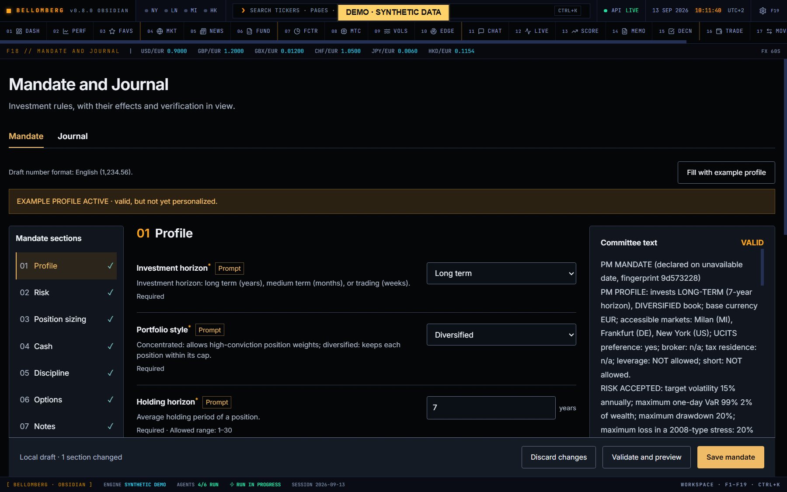

# F18 — Mandate and Journal

[Handbook](../README.md) · [Previous: F17](./17-movements.md) · [Next: F19](./19-settings.md)

*English app screenshot with invented DEMO data. Analytics and histories are
authored synthetic snapshots, not results measured on a real account.*

The [workflow illustration](../../assets/product/18-mandate-journal.svg) is a separate,
simplified diagram with Italian labels.

This destination has two tabs: **Mandate** (*Mandato*) defines your declared
rules; **Journal** (*Diario*) is your private writing space. Neither is supplied
as a prefilled personal investment profile in the public distribution.

## Define your mandate
1. Open **Mandate**. **Mandate sections** (*Sezioni del mandato*) lists seven
   sections: Profile, Risk, Position sizing, Cash, Discipline, Options and Notes.
   Select one to show its fields. Each entry shows **!** for errors, the number
   of required fields still missing, or **✓** when complete.
2. Complete the fields for your own process. **Fill with example profile**
   (*Compila con profilo di esempio*) loads the example values into your draft;
   its sample values are not a recommended mandate.
3. Inspect validation and coverage badges. They distinguish rules enforced by
   code from instructions interpreted by agents.
4. Press **Validate and preview** (*Verifica e apri anteprima*), read the committee
   text, then press **Save mandate** (*Salva mandato*). Saving stays disabled until
   the current draft has a valid preview.
5. Review the saved mandate before the next committee run.

A saved field is not automatically a deterministic constraint. Read its
coverage: some limits are enforced in code, while others are prompt guidance.
A missing or invalid required mandate can prevent a committee run rather than
silently selecting somebody else's preferences.

## Write a journal entry

*An invented thesis beside its earlier versions. The Mandate screenshot above shows an unsaved preview.*

1. Open **Journal** and press **New note** (*Nuova nota*).
2. In **Note type** (*Tipo di nota*), select **Investment thesis** (*Tesi su un
   titolo*) or **Macro scenario** (*Scenario macro*). Add a title and an optional
   ticker; suggestions come from your current portfolio, and you can type any
   other ticker.
3. Write the thesis, evidence, risks and what would change your mind.
4. Save and inspect the entry's timestamp, version and explicit user origin.

Titles allow up to 160 characters and note bodies up to 30,000. Journal text is
stored in SQLite with revision history. It is **not automatically ingested,
embedded or sent to the research agents**. To share it, explicitly select text
and include it in your chosen conversation or workflow.

## Revise without losing the past
Select an entry in **Your notes** (*Le tue note*), edit it and press **Save new
version** (*Salva nuova versione*). The **How your idea evolves** (*Come evolve la
tua idea*) column beside the editor lists earlier revisions: expand one to read
it, or press **Load earlier versions** (*Carica versioni precedenti*) for older
ones. **Use this version as a draft** (*Usa questa versione come bozza*) loads it
into the editor as a new draft, so the existing history stays intact.

If another editor saved a newer version, the app rejects the outdated save
with a conflict rather than overwriting it. Read the current server version,
compare it with your draft and intentionally combine the changes before saving
again. Archive and restore are reversible; there is no destructive delete
button in this workflow.

Search and filters help find stock or macro notes. Archived entries can be
included when you need to recover one.

## Drafts and privacy
Unsaved drafts can survive navigation within the same running interface, but
they are not a durable backup. Reloading or closing the application can discard
them; heed the unsaved-change prompt and save deliberately.

In **Mandate**, an unsaved draft kept for the current session is offered as
**RECOVERABLE DRAFT** (*BOZZA RECUPERABILE*) with **RESTORE EXPLICITLY**
(*RIPRISTINA ESPLICITAMENTE*) and **DISCARD** (*SCARTA*). A draft whose number
format is missing or not recognised says so: restoring reads it as Italian
(1.234,56), and the notice stays until you save. Check the numbers before saving.

Journal reads and writes require an authenticated session. Keep the database
and its backups private. A missing journal schema or database failure is shown
as an error, not as a successful empty notebook. See [updates](../updates.md) for
schema changes and backup precautions.
