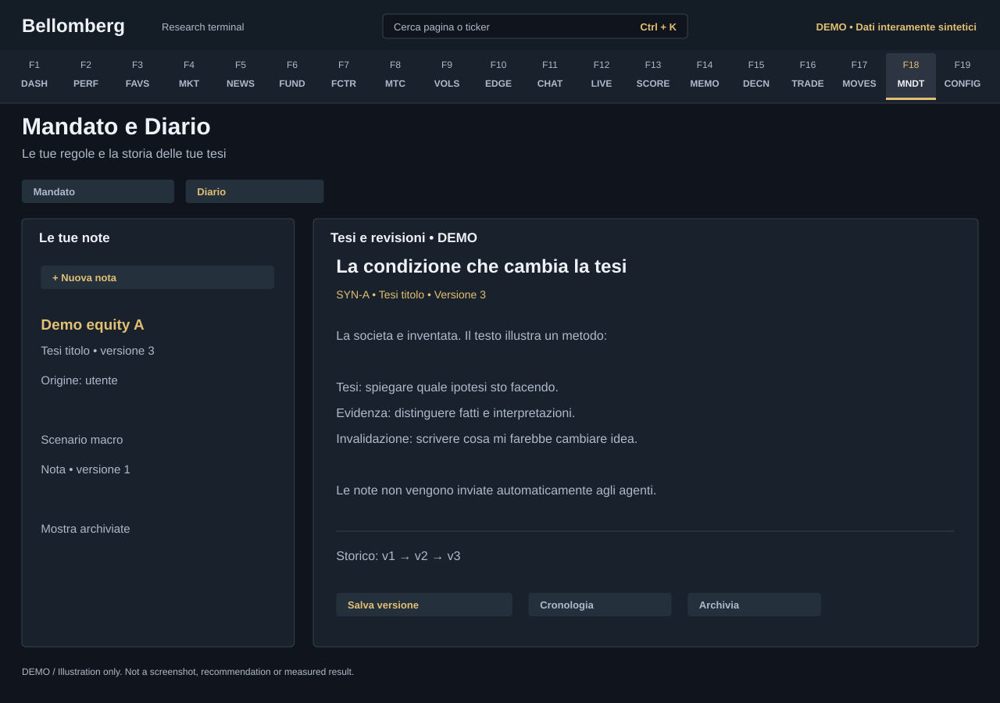

# F18 — Mandate and Journal

[Handbook](../README.md) · [Previous: F17](./17-movements.md) · [Next: F19](./19-settings.md)

*DEMO illustration: invented instruments, values and text; not a screenshot.*

This destination has two internal tabs: **Mandato** defines your declared rules;
**Diario** is your private writing space. Neither is supplied as a prefilled
personal investment profile in the public distribution.

## Define your mandate
1. Open **Mandato** and read the available sections covering the investment
   universe, portfolio constraints and research preferences.
2. Complete the fields for your own process. The example schema explains the
   structure; its sample values are not a recommended mandate.
3. Inspect validation and coverage badges. They distinguish rules enforced by
   code from instructions interpreted by agents.
4. Preview the changes, then save.
5. Review the saved mandate before the next committee run.

A saved field is not automatically a deterministic constraint. Read its
coverage: some limits are enforced in code, while others are prompt guidance.
A missing or invalid required mandate can prevent a committee run rather than
silently selecting somebody else's preferences.

## Write a journal entry
1. Open **Diario** and choose a new note.
2. Select a stock thesis or macro thought. Add a title and an optional ticker;
   ticker text is yours to enter, not a fixed list of example holdings.
3. Write the thesis, evidence, risks and what would change your mind.
4. Save and inspect the entry's timestamp, version and explicit user origin.

Titles allow up to 160 characters and note bodies up to 30,000. Journal text is
stored in SQLite with revision history. It is **not automatically ingested,
embedded or sent to the research agents**. To share it, explicitly select text
and include it in your chosen conversation or workflow.

## Revise without losing the past
Select an entry, edit it and save a new version. Open history to inspect earlier
revisions; loading an old revision into the editor creates a new draft, so the
existing history stays intact.

If another editor saved a newer version, the app rejects the outdated save
with a conflict rather than overwriting it. Read the current server version,
compare it with your draft and intentionally combine the changes before saving
again. Archive and restore are reversible; there is no destructive delete
button in this workflow.

Search and filters help find stock or macro notes. Archived entries can be
included when you need to recover one.

## Drafts and privacy
Unsaved drafts can survive navigation within the same running interface, but
they are not a durable backup. Reloading or closing the application can discard
them; heed the unsaved-change prompt and save deliberately.

Journal reads and writes require an authenticated session. Keep the database
and its backups private. A missing journal schema or database failure is shown
as an error, not as a successful empty notebook. See [updates](../updates.md) for
schema changes and backup precautions.
