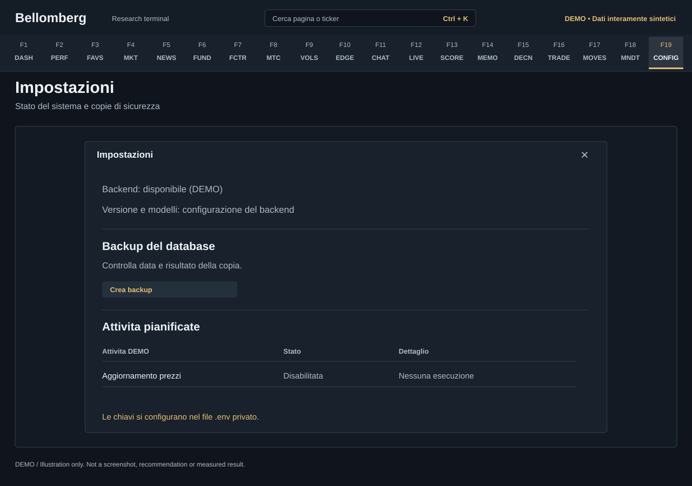

# F19 — Settings

[Handbook](../README.md) · [Previous: F18](./18-mandate-journal.md)

*DEMO illustration: invented instruments, values and text; not a screenshot.*

**F19** opens the settings panel. It is the last navigation destination and is
also reachable through **Ctrl+K → F19**. It is a panel over the current workspace,
not a separate research route.

## Use it
1. Inspect backend health and version when diagnosing a connection problem.
2. Read the displayed model configuration to understand which configured roles
   the backend reports. Availability still depends on your provider account.
3. Review task or scheduler status and any errors. A disabled task is distinct
   from a failed or unknown task.
4. Inspect the backup calendar/list and create a database backup when needed.
5. Close the panel with its close control or Escape to return to your page.

## Backup controls
A successful SQLite backup is useful evidence for that database. It does not
prove that every private JSON store, attachment, report, research index or
credential file was backed up too. Follow the broader
[update and privacy guide](../updates.md).

Deleting a backup is a destructive action and has a confirmation step. Keep a
known-good copy before deleting older ones. This panel is not a general restore
wizard; plan a restore with writers stopped and a copy of the current state.

## What is configured elsewhere
Edit credentials and environment settings in your private .env file, then
restart the relevant process. The panel is not a secret-key editor or a model
marketplace. It does not make Windows scheduler installation portable to other
operating systems.

Reported health means the checked component answered. It is not proof that every
market provider, AI model and historical dataset is available. Use the
[troubleshooting guide](../troubleshooting.md) to narrow a failure to its source.
